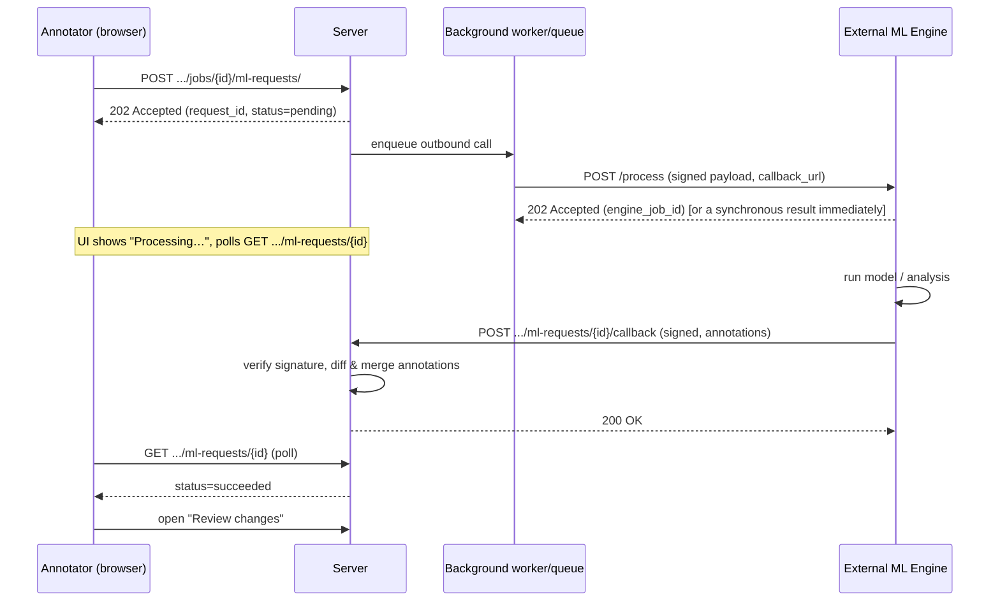

# Tech Spec: GeoTIFF Annotation + External ML Engine Integration

Implements [SPEC.md](SPEC.md). Read that first for the *what/why*; this document is
the *how* — architecture, data model, algorithms, and API contracts — kept as
platform-agnostic as the subject matter allows. Where a design decision is genuinely
tied to CVAT's specific extension points, that's called out explicitly in its own
"CVAT integration seam" note, so a reader targeting a different CVAT version (or a
different platform entirely) knows exactly which parts to re-locate versus which parts
to reuse verbatim.

## 1. Architectural overview

Five logical components, in decreasing order of portability:

```
┌─────────────────────────────────────────────────────────────────────┐
│  1. Tiling library            (pure, no framework/DB dependency)    │
│  2. Coordinate transform library (pure, no framework/DB dependency) │
├─────────────────────────────────────────────────────────────────────┤
│  3. Persistence layer          (ORM models; framework-coupled)      │
│  4. Host-platform integration shims (media source, dataset format,  │
│     permission checks — each is a seam into the host platform)      │
│  5. HTTP API + background worker + external engine contract         │
└─────────────────────────────────────────────────────────────────────┘
                              │
                              ▼
                 Frontend integration points
        (toolbar action, status polling, review UI,
         live class-selector correctness, geo status bar)
```

Components 1–2 should have **zero** dependency on the host platform's web framework,
ORM, or request lifecycle — they take arrays/paths/coefficients in, return
arrays/coordinates out, and are unit-testable with nothing running (no DB, no queue,
no HTTP server). This is deliberate: it's the part of the system with the best chance
of surviving a platform migration unchanged, and the fastest to get real test coverage
on without standing up infrastructure.

Components 3–5 are where "host platform" specifics live. Section 7 enumerates every
seam explicitly.

## 2. Data model

Five entities. Field types are described generically (string/int/float/enum/blob);
map them to whatever ORM/schema system the host platform uses.

### 2.1 `RasterSource` — one row per ingested raster

| Field | Type | Notes |
|---|---|---|
| `task_id` | FK → Task | Owning task. |
| `source_path` | string | Path relative to the task's own data root — keeps this portable across storage backends. |
| `crs_wkt` | text | Only meaningful when `georeferencing_kind == AFFINE`. |
| `georeferencing_kind` | enum(`affine`, `rpc`) | See §3.3. |
| `transform_a..f` | float, nullable | Affine coefficients `(x,y) = (a·col + b·row + c, d·col + e·row + f)` — GDAL/rasterio ordering. Null unless `AFFINE`. |
| `rpc_coefficients` | JSON, nullable | RPC00B coefficient set. Null unless `RPC`. |
| `width`, `height` | int | Full raster dimensions. |
| `band_count`, `dtype` | int, string | Original band/dtype info, kept even though display tiles are re-encoded (see §3.1). |
| `nodata_value` | float, nullable | |
| `tile_size`, `overlap` | int | The values actually used at ingestion time (independent of any later default change). |
| `was_reencoded_as_cog` | bool | Whether ingestion re-encoded the source into a windowed-read-friendly layout. |
| `display_bands` | list[int] | 1-indexed band numbers mapped onto the browser-facing tile images. |

**Invariant:** exactly one of the affine-coefficient group or `rpc_coefficients` is
populated, matching `georeferencing_kind` — enforce this at the boundary that
constructs the row, not just by convention.

### 2.2 `RasterTile` — one row per tile

| Field | Type | Notes |
|---|---|---|
| `raster_source_id` | FK → RasterSource | |
| `frame` | int | The host platform's own frame index this tile was materialized as. **Unique per `(raster_source, frame)`.** |
| `row`, `col` | int | Position within the tile grid. |
| `col_off`, `row_off` | int | Top-left pixel offset within the *source* raster's native pixel grid. |
| `width`, `height` | int | This tile's pixel dimensions (uniform across the grid, including padded edge tiles). |
| `pad_right`, `pad_bottom` | int | How much of this tile's width/height is padding, not real raster data (0 for interior tiles). |

This is the join every downstream consumer (coordinate conversion, the ML engine
payload, any export format) uses to go from "a shape on frame N" to "a pixel window
within the source raster" and, from there, to real-world coordinates.

### 2.3 `RasterTaskConfig` — per-task ingestion settings

One row per task: `tile_size`, `overlap`, `reencode_as_cog` flag. Exists so re-tiling
or debugging a tile grid's shape is reproducible without re-deriving the settings from
the original upload request. (Known implementation gap in the reference build: this
table is *defined* but nothing currently writes to it — `tile_size`/`overlap` are read
off the request and used directly. Worth fixing before relying on it.)

### 2.4 `ProcessingEngineConfig` — where a Task/Project's engine lives

| Field | Type | Notes |
|---|---|---|
| `project_id` / `task_id` | FK, nullable | **Exactly one** must be set — task-level scoping takes precedence over project-level when both could apply. |
| `base_url` | URL | The engine's HTTP endpoint. |
| `secret` | string | Shared HMAC secret. |
| `timeout_seconds` | int | Default 60; used by the timeout sweep (§6). |
| `enabled` | bool | |

Resolution rule: a task-level, enabled config wins; otherwise fall back to the task's
project-level, enabled config if any; otherwise no engine is configured for that task
and the send action should not be offered.

### 2.5 `MLProcessingRequest` — one round trip

| Field | Type | Notes |
|---|---|---|
| `id` | UUID (client-visible identifier) | Used as the poll/callback correlation key. |
| `job_id` | FK → Job | |
| `status` | enum: `pending`, `processing`, `succeeded`, `failed`, `timed_out` | |
| `submitted_by` | FK → User, nullable | |
| `engine_job_id` | string | The engine's own identifier for this work, if it gave one. |
| `error_message` | text | Populated on `failed`/`timed_out`. |
| `result_summary` | JSON, nullable | Whatever summary metadata is worth keeping post-merge (counts, timing, etc.) |

`unfinished()` = `pending` ∪ `processing`. Enforce **at most one unfinished request per
job** at the point a new one is created — reject a second attempt rather than queuing
it.

## 3. Core algorithms

### 3.1 Tile grid construction

Given raster dimensions `(W, H)`, `tile_size T`, `overlap V` (`0 ≤ V < T`):

```
stride = T - V
n_cols = ceil(max(W - V, 0) / stride)      # or 1 if W <= T
n_rows = ceil(max(H - V, 0) / stride)
for row in 0..n_rows-1:
  for col in 0..n_cols-1:
    col_off = col * stride
    row_off = row * stride
    width  = min(T, W - col_off)   # pre-padding
    height = min(T, H - row_off)
    pad_right  = T - width
    pad_bottom = T - height
    frame_index = row * n_cols + col     # row-major
```

Every tile is read via a **windowed read** (rasterio `Window(col_off, row_off, width,
height)` or the equivalent in whatever raster I/O library is available) directly
against the source file — never a full-raster decode. Padding is applied only to the
*output* tile buffer (fill with the raster's own nodata value, or a fixed sentinel if
none is defined), never to the source read window.

If `tile_size` is set at or above the raster's largest dimension with `overlap = 0`,
the "grid" degenerates to a single tile covering the whole raster — this is the
supported single-frame path, still bounded by whatever whole-image decode limit the
host platform's own display pipeline imposes (e.g. PIL's ~179-megapixel
decompression-bomb guard) if the display tile itself is later decoded by that
pipeline.

**COG re-encoding**: if the source isn't already a Cloud-Optimized GeoTIFF, re-encode
it once at ingestion time (`gdal_translate -of COG` / `rio cogeo create` or
equivalent) before tiling. This changes container layout, never pixel values — verify
any fallback re-encoding path explicitly preserves GCP/RPC tags (a real bug found in
the reference build: a manual COG fallback path silently dropped them when the
installed GDAL lacked a native COG driver).

### 3.2 Display tile materialization

Each tile's window is read and written out as a standard 8-bit RGB/RGBA image (PNG is
a reasonable default) using the configured `display_bands`, going through the same
on-disk chunk/cache mechanism the host platform already uses to serve ordinary image
frames to the browser — no changes needed to frame-serving or client-side rendering.
Original bit depth/band data can optionally be cached separately (keyed by tile) if a
downstream consumer (e.g. the ML engine) needs the raw radiometric data rather than
the display-oriented image.

**Materialize eagerly, not lazily**, if the host platform's own manifest/thumbnail
generation expects to open frame files directly from disk rather than calling back
into a custom reader's `get_image()`-equivalent method — a real bug in the reference
build until this was corrected.

### 3.3 Coordinate transforms

Two georeferencing models, one shared dispatch boundary (`pixel→geo` /
`geo→pixel`, both in tile-local and whole-raster-pixel variants):

**Affine** (direct, or GCP-fitted):
```
(x, y) = (a·col + b·row + c, d·col + e·row + f)
```
GCP case: fit `(a..f)` once from the GCP correspondences at ingestion time (least-
squares / `rasterio.transform.from_gcps` or equivalent), then treat identically to a
directly-georeferenced raster from that point on — no further GCP-specific branching
anywhere downstream.

**RPC** (Rational Polynomial Coefficients): a pair of cubic-rational-polynomial
functions per RPC00B. Forward (ground → image) is a direct evaluation. **Inverse
(image → ground) has no closed form** — solve iteratively:

```
guess = (lon0, lat0)                    # e.g. the model's own reference point
repeat until convergence or max iterations:
    (col_pred, row_pred) = rpc_forward(guess, height=assumed_flat_height)
    residual = (col_target - col_pred, row_target - row_pred)
    J = finite_difference_jacobian(rpc_forward, guess)
    guess -= inverse(J) · residual      # Newton-Raphson step
```

Height is assumed flat (a fixed reference elevation, e.g. 0) unless draped onto a real
DEM — an accepted, bounded accuracy limitation (see SPEC.md §5).

**The one correctness trap worth over-documenting**: RPC00B's own term-order
convention assigns longitude and latitude to specific polynomial variables in a
*fixed, spec-defined order*. Swapping them is a real bug that is **invisible at the
model's own reference point** — every non-constant polynomial term evaluates to zero
there by construction, so a naive self-test (evaluate at the reference point, check
you get the reference point back) passes even with the swap. It only shows up as
error (hundreds of meters, in the reference build's case) away from that single point.
**Never validate an RPC (or any nonlinear-model) implementation solely at its own
reference/origin point** — validate against independently-known ground-truth
coordinates elsewhere in the raster's extent, ideally cross-checked against a
*different* georeferencing model for the same physical scene if one is available
(e.g. a GCP-derived affine fit for the same imagery).

### 3.4 Whole-raster import clipping

An imported geographic feature may span more than one tile. Algorithm:

1. Try the fast path: does the feature's whole geometry fit inside exactly one tile's
   pixel window (after `geo → raster-pixel` conversion)? If yes, emit one shape there
   and stop.
2. Otherwise, convert the feature to raster-pixel space (the *untiled* counterpart of
   the tile-local conversion — same dispatch-on-georeferencing-model boundary),
   and geometrically intersect it against every tile window it overlaps (a
   computational-geometry library's polygon/line intersection, e.g. Shapely or
   equivalent, is sufficient — no custom clipping math needed).
3. Emit one shape per tile per resulting non-empty piece:
   - A polygon (or rectangle, represented as a polygon post-conversion — see SPEC.md
     FR2's lossy-rectangle note) clipped by an axis-aligned tile window stays a single
     polygon per tile it overlaps, or splits into multiple pieces within the *same*
     tile if a concave shape is disconnected by the tile boundary (one CVAT-style shape
     can't represent disjoint geometry, so each disjoint piece is its own shape).
   - A line crossing a boundary becomes one line segment per tile; a line that exits
     and re-enters the same tile becomes more than one segment there.
   - A multi-point feature is bucketed by which tile each point falls in.

### 3.5 Auto-registering unrecognized classes on import

For each feature's class name, in import order:
1. Check it against the target task's (or its project's, if any) already-known
   classes — checked live, not against a cache taken before this import started (see
   §7.2 for why this matters).
2. If unknown, create it (a reasonable default: unrestricted shape-type scope, i.e.
   usable for any shape type; auto-assigned display color via whatever helper the host
   platform's own class-creation path already uses, for consistency) and register it
   into whatever in-memory class cache the rest of the import loop consults, so
   later features in the *same* import see it immediately too.
3. Idempotent: importing the same new class name twice must not create a duplicate.
4. Applies going forward only — never retroactively relabels existing annotations.

## 4. API / payload contracts

Kept independent of URL scheme — mount these wherever the host platform's routing
convention expects new endpoints to live.

### 4.1 Ingestion configuration (part of task creation)

Request fields added to task/data creation: `tile_size` (int), `overlap` (int, must be
`< tile_size`). Response/read-back: expose the *actual* values used (from
`RasterTaskConfig`/`RasterSource`, not just an echo of the request) since re-encoding
or clamping may adjust them.

### 4.2 Geo-frame lookup

`GET /.../tasks/{id}/geospatial/frames/` → per frame: its four corner coordinates in
the raster's real-world CRS (or WGS84 for RPC). Consumed by any live geo-readout UI
(cursor position status bar, ruler/measurement tool) — a read-only, cheap endpoint,
not tied to the annotation-editing path.

### 4.3 Send job to processing engine

`POST /.../jobs/{job_id}/ml-requests/` →
```json
{ "request_id": "<uuid>", "status": "pending" }
```
Returns `202 Accepted` immediately; the actual outbound call to the engine happens out
of band (background worker). Reject with a conflict status if the job already has an
unfinished request.

### 4.4 Outbound payload (server → engine)

```json
{
  "request_id": "b6c1c8b0-...",
  "job_id": 4821,
  "task_id": 933,
  "callback_url": "https://.../ml-requests/b6c1c8b0-.../callback/",
  "frames": [
    {
      "frame": 0,
      "image_url": "https://.../jobs/4821/data?type=frame&number=0",
      "raster_source_id": 17,
      "pixel_window": { "col_off": 0, "row_off": 0, "width": 1024, "height": 1024 },
      "geotransform": [ /* affine coefficients, present only if AFFINE */ ],
      "rpc_coefficients": { /* present only if RPC */ },
      "crs": "EPSG:32648"
    }
  ],
  "annotations": { /* current job annotations, host platform's own export schema */ }
}
```
Signed with HMAC-SHA256 over the raw body using the Task/Project's configured shared
secret, carried in a header (e.g. `X-Signature-256`, matching whatever convention the
host platform's own outbound-webhook signing already uses, for consistency).
`callback_url` travels *in* the payload rather than being separately configured on the
engine, so the engine needs no CVAT-side knowledge beyond the shared secret.
`image_url` should be a short-lived, request-scoped signed URL, not a raw session
token.

### 4.5 Callback (engine → server)

`POST {callback_url}`, same HMAC scheme, verified **before** any further processing.
```json
{
  "request_id": "b6c1c8b0-...",
  "status": "succeeded",
  "annotations": { /* proposed annotations, same schema as 4.4's outbound */ },
  "error_message": null
}
```
or, on failure: `"status": "failed", "error_message": "<why>"`.

Must be **idempotent on `request_id`**: a duplicate callback for an already-resolved
request is acknowledged (`200`) but produces no second merge.

### 4.6 Status poll

`GET /.../ml-requests/{request_id}` → the `MLProcessingRequest` fields (§2.5) as JSON.
Polled on a short interval by the frontend rather than requiring a persistent
connection — processing latency is expected in seconds-to-minutes, not needing
sub-second updates.

## 5. Sequence diagrams

**GeoTIFF ingestion:**
```mermaid
sequenceDiagram
    participant U as Uploader
    participant S as Server
    participant GD as Raster I/O (GDAL/rasterio-equivalent)
    participant WD as Host platform's work-distribution logic

    U->>S: Create Task, upload GeoTIFF
    S->>GD: inspect CRS/GCP/RPC, size; re-encode to COG if needed
    S->>GD: windowed read per tile (grid + overlap)
    GD-->>S: tile pixel arrays
    S->>S: write chunk cache (display tile) + RasterTile rows
    S->>WD: create Task with N tile-frames, segment_size=S
    WD-->>S: Jobs created (native splitting, unmodified)
```

**ML engine round trip:**


## 6. Security model

- HMAC-SHA256 (or stronger) signing on both the outbound-to-engine and
  inbound-callback legs, shared secret configured per Task/Project.
- Network-level trust (allowlist / private segment) between server and engine, in
  addition to signing — a leaked secret plus open network access is a strictly worse
  position than either alone.
- Every new endpoint must go through the host platform's real object-level permission
  checks for "can this user view/edit this job" — not a bespoke, weaker stand-in,
  except as an explicitly-flagged interim step during initial build-out (see
  IMPLEMENTATION_GUIDE.md §7 item 1).
- Frame image URLs handed to the engine: short-lived, scoped to the specific request's
  frames — never a general-purpose session token the engine could use to browse
  unrelated data.
- Outbound retries: exponential backoff on connection-level failure only. An
  application-level failure the engine explicitly reports must surface to the human,
  never be silently retried into a false "still trying" state.

## 7. Integration seams (host-platform-specific — re-locate per version/platform)

These are the points where *this* design necessarily reaches into whatever annotation
platform it's built on. Each is described as a **capability the host platform must
expose**, not as a specific file/class name, precisely so this section survives a
platform-version change.

### 7.1 A pluggable media/frame source

**Capability needed:** a way to register a new kind of task data source that produces
a numbered sequence of frames, sitting alongside however the platform already handles
"a directory of images" or "a video file" — ideally claimed *before* any generic
extension-based file-type detection would otherwise misclassify it (a georeferenced
TIFF is still a `.tif`/`.tiff` file to a naive extension check).

**Generic gotcha, not platform-specific:** if the platform's manifest/thumbnail
generation opens frame files directly from disk rather than calling back into your
source's own image-fetch method, your tile images must be materialized to disk
eagerly at ingestion time, not generated lazily on first request.

### 7.2 A pluggable dataset export/import format

**Capability needed:** a way to register a new named export/import format (here,
geographic feature collections) into whatever format-registry mechanism the platform
already uses for its built-in formats (COCO, XML, etc.).

**Generic gotcha, not platform-specific, and likely to recur on *any* ORM with query-
result caching**: if the platform validates an imported shape's class against a
**prefetched** relation (a query result cached once and reused across many
operations), a class your import creates *mid-import* can be genuinely committed to
the database and still fail validation, because the prefetch snapshot was taken before
your write and never refreshes itself. This is not a one-time bug to patch and forget
— audit **every** code path that constructs whatever object holds that prefetched
relation (in the reference build, this bit twice: once for a job-level import, and
again, separately, for a task-level import that reused an object fetched even earlier
than the job-level path did). The fix that actually held was making label/class
lookup **always** re-query directly rather than trusting the prefetch, at every
construction site — not patching the first call site found and assuming the rest were
fine.

### 7.3 Existing work-distribution/splitting logic

**Capability needed:** none, beyond confirming the platform already splits "a task's
frame sequence" into assignable jobs independent of what produced that sequence. This
design deliberately adds zero new distribution logic — if the platform's splitter
requires a change to accept a tiled-raster-backed task, that's a sign of hidden
coupling worth flagging up front rather than working around.

### 7.4 Object-level permission framework

**Capability needed:** a way to gate a new endpoint by "can this user view/edit this
specific job's annotations", ideally reusing whatever policy language the platform
already uses for its own endpoints (rather than duplicating the visibility logic by
hand) so a future permission-model change doesn't need to be independently
re-applied here. See IMPLEMENTATION_GUIDE.md §7 item 1 for what production-grade
wiring looks like on top of an interim hand-rolled check.

### 7.5 Frontend class-selector state

**Capability needed:** wherever the platform's UI holds "the current job's set of
available classes" in client-side state, and wherever it derives a **filtered**
version of that set per shape-type tool (Section 3.5/SPEC.md FR8), both must be
capable of updating **live**, and every already-constructed instance of that filtered
view must actually notice the update — not just instances created after the change.

**Generic gotcha, not platform-specific:** if each shape-type tool's selector is a
separate, long-lived UI component instance (one per tool, kept alive once opened
rather than recreated), and that component computes its filtered class list **only at
construction time**, then a live update to the underlying class list will correctly
reach whichever instance hasn't been opened yet (fresh construction sees it) while
silently *not* reaching an instance already opened before the update — with every
shape-type tool exhibiting this identically, since it isn't about which tool, it's
about whether that tool's component happened to exist yet. The fix is for that
component to explicitly recompute its filtered view whenever the underlying class
list prop/state changes, not only in its constructor. **Test this by opening the
selector before triggering the update, not after** — the "after" case can look
correct by accident.

**Related ordering gotcha:** if updating the live class list and rebuilding the
client's annotation collection from a fresh server response are two separate steps,
the class-list update **must complete first**. Building an annotation object for a
shape that references a class the client doesn't know about yet is a null-reference
crash waiting to happen, not a cosmetic "class shows blank" glitch — get the ordering
right rather than defensively null-checking around it.

### 7.6 Timeout sweep

**Capability needed:** *some* periodic execution mechanism (a scheduled job, a
management command on cron, a queue-native scheduler) the platform already has, to
scan for unfinished `MLProcessingRequest` rows past their configured timeout and
transition them. Not itself platform-specific in design, but the *mechanism* for
"run this periodically" will be.

## 8. What's genuinely platform-agnostic vs. what isn't

| Portable as-is | Needs a platform-specific seam |
|---|---|
| Tile grid math (§3.1) | Registering a new frame source (§7.1) |
| Coordinate transform library, both models (§3.3) | Dataset format registry hook + prefetch-cache gotcha (§7.2) |
| Whole-raster clipping algorithm (§3.4) | Object-level permission framework (§7.4) |
| Payload/callback JSON schemas (§4.4–4.5) | Frontend class-selector live-update mechanics (§7.5) |
| HMAC signing scheme | Whatever queue/worker technology executes the outbound call |
| Auto-registration *logic* (§3.5) | The exact validation path that logic must out-run (§7.2) |
